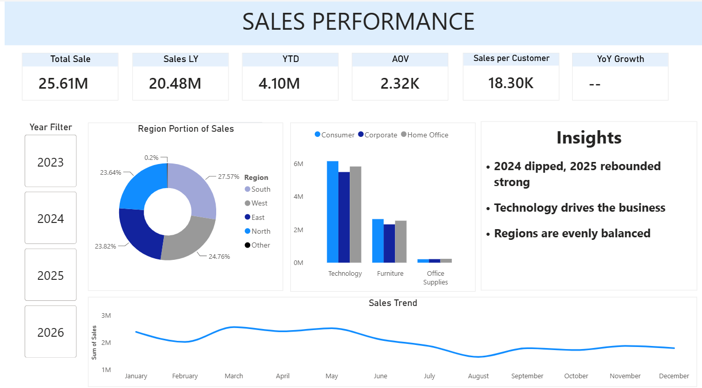

# Sales-Performance
End-to-end BI project: SQL Server star schema → Power BI dashboard,
built on Superstore sales data.

## Star Schema

FactSales connects to 5 dimensions (DimDate, DimCustomer, DimProduct, 
DimTerritory, DimOrder). DimDate is a single-column role-playing 
dimension built via UNION of Order_Date, Ship_Date, and Date_Entry, 
so all date filtering routes through one table.

## Dashboard

## Data quality issues found and fixed
- **$353K reconciliation gap**: dashboard totals didn't match the 
  Region breakdown. Root cause: blank (empty string) Region values 
  weren't caught by a NULL check in the fallback logic — fixed with 
  NULLIF to catch both NULL and blank. [screenshot before/after optional]
- **Ambiguous model relationship**: FactSales and DimOrder shared 
  both Order_ID and Order_Date, creating two possible join paths. 
  Resolved by dropping Order_Date from DimOrder, leaving Order_ID 
  as the single relationship key.
- **YoY Growth measure returning a misleading number**: with no 
  year filter applied, the measure was comparing 4 years of pooled 
  sales against 3 years (a SAMEPERIODLASTYEAR artifact with no 2022 
  data to shift into). Fixed with a HASONEVALUE guard so the measure 
  only calculates against a single selected year.

## Known limitation
2026 data is partial (through ~July/August), so YoY comparisons 
against 2026 understate performance rather than reflecting a real 
decline.
